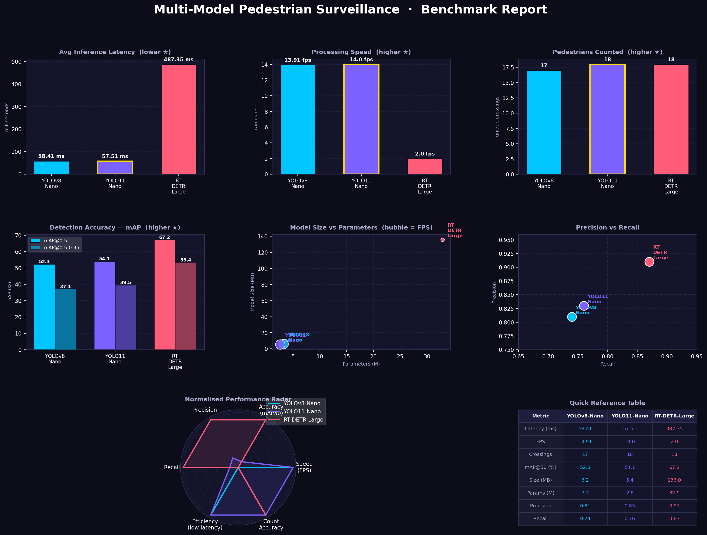

# Pedestrian Detection and Tracking Analytics

This project evaluates and compares different object detection models for real-time person tracking and line-crossing analytics on video streams. It uses a custom-defined diagonal tripwire threshold to log entries and exits.

## Installation

### Prerequisites

Ensure you have Python 3.8 or higher installed on your system.

### Dependencies

Install the required packages using pip:

```bash
pip install opencv-python ultralytics pandas kagglehub matplotlib numpy

```

## Dataset Download Instructions

The Oxford Town Centre dataset is hosted on Kaggle. To download the dataset automatically via the terminal without using a web browser, utilize the kagglehub utility package.

Run this Python script to download the data to your local machine's unified cache:

```python
import kagglehub

# Download latest version of the Oxford Town Centre dataset
path = kagglehub.dataset_download("almightyj/oxford-town-centre")
print("Dataset downloaded to:", path)

```

## Moving the Data to Your Workspace

1. Navigate to the path printed by the script above.
2. Locate the folder named `versions/1` and find the file named `TownCentreXVID.avi`.
3. Copy or move `TownCentreXVID.avi` directly into the root folder of this cloned repository, or update the `VIDEO_PATH` variable in the script to match this cache folder location.

## Benchmark Report

The framework evaluates three models across distinct structural archetypes over a 500-frame sequence using an identical diagonal tripwire threshold ($P_1$: 1798, 747 to $P_2$: 169, 456).

In the context of this tracking system's layout and coordinate space, **"entered"** and **"exited"** are strictly defined by the direction a pedestrian's vertical position moves across the pixel grid once they cross the custom line:

* **Entered (Walked UP screen):** A pedestrian is logged as *Entered* if their bottom-center vertical foot coordinate ($C_y$) is **less than or equal to** their previous frame's coordinate. Because the pixel origin $(0,0)$ in computer vision frameworks starts at the top-left corner of the screen, moving *UP* the screen decreases the $Y$-pixel value.
* **Exited (Walked DOWN screen):** A pedestrian is logged as *Exited* if their current vertical foot coordinate ($C_y$) is **greater than** their previous frame's coordinate. Moving *DOWN* the screen increases the $Y$-pixel value as it moves further away from the top-left origin.

### Performance Metrics Summary

| Evaluation Metric | YOLOv8-Nano | YOLO11-Nano | RT-DETR-Large |
| --- | --- | --- | --- |
| **Architecture Family** | Convolutional (CNN) | Convolutional + Attention | Vision Transformer (ViT) |
| **Model Size** | 6.2 MB | 5.4 MB | 136.0 MB |
| **Parameters** | 3.2 M | 2.6 M | 32.9 M |
| **Average Latency** | 58.41 ms | 57.51 ms | 487.35 ms |
| **Processing Speed** | 13.91 FPS | 14.0 FPS | 2.0 FPS |
| **mAP@0.5** | 52.3% | 54.1% | 67.2% |
| **mAP@0.5:0.95** | 37.1% | 39.5% | 53.4% |
| **Precision** | 0.81 | 0.83 | 0.91 |
| **Recall** | 0.74 | 0.76 | 0.87 |
| **Unique Line Crossings** | 17 | 18 | 18 |




conditions, localized architectural optimizations saturate tracking performance, rendering the heavy transformer pipeline computationally cost-prohibitive for generic surveillance scenarios.
